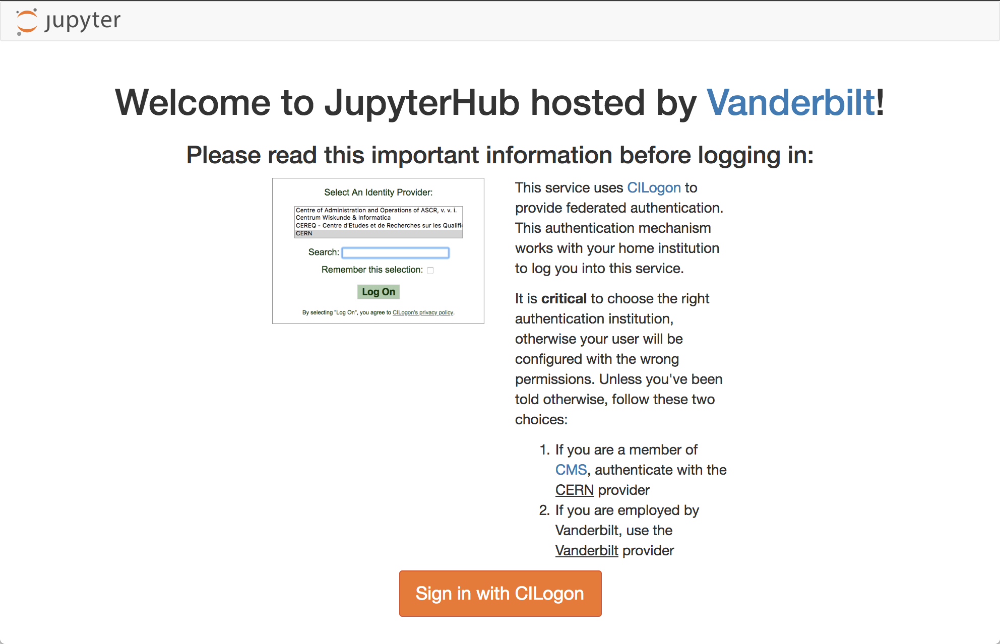

# CMS Machine Learning Data Analsyis School (DAS) Short Exercise


Based on CMSDAS 2019 @LPC Machine Learning Exercise, written by Xavier Duarte
Editted and expanded by CMSDAS 2019 Pisa Facilitators: Thong Nguyen, Sitong An, Leonardo Giannini.

## Introduction

This is a set of tutorials for the CMS Machine Learning Data Analysis School (DAS) Short Exercise. They are intended to show you how to build machine learning models in python (`Keras`/`TensorFlow`) and use them in your `ROOT`-based analyses. We will build event-level classifiers for differentiating VBF Higgs and standard model background 4 muon events and jet-level classifiers for differentiating boosted W boson jets from QCD jets.

## Main notebooks in this tutorial

 &nbsp;0. &nbsp;[`0-setup-libraries.ipynb`](0-setup-libraries.ipynb): setting up libraries using `CMSSW`  
 &nbsp;1. &nbsp;[`1-TMVA-Classification-py.ipynb`](1-TMVA-Classification-py.ipynb): Simple BDT Demonstration with 'TMVA' in Python  
 &nbsp;2.  [`2-datasets.ipynb`](2-datasets.ipynb): reading/writing datasets from `ROOT` files with 'root2hdf5'  
 &nbsp;2.1 [`2.1-datasets-uproot.ipynb`](2.1-datasets-uproot.ipynb): Same with notebook 2, but with `uproot`  
 &nbsp;3. &nbsp;[`3-plotting.ipynb`](3-plotting.ipynb): plotting with `pyROOT` and `matplotlib`  
 &nbsp;4. &nbsp;[`4-dense.ipynb`](4-dense.ipynb): building, training, and evaluating a fully connected (dense) neural network in `Keras`  
 &nbsp;4.1 [`4.1-dense-pytorch.ipynb`](4.1-dense-pytorch.ipynb): Same with notebook 4, but with `PyTorch`  
 &nbsp;4.2 [`4.2-dense-bayesian-optimization.ipynb`](4.2-dense-bayesian-optimization.ipynb): Optimize a dense network with Bayesian optimization  
 &nbsp;5. &nbsp;[`5-preprocessing.ipynb`](5-preprocessing.ipynb): preprocessing CMS open data to build jet-images (optional)  
 &nbsp;6. &nbsp;[`6-conv2d.ipynb`](6-conv2d.ipynb): building, training, and evaluating a 2D convolutional neural network in `Keras`  

## Setup

We will be using the Vanderbilt JupyterHub. Point your browser to:

[https://jupyter.accre.vanderbilt.edu/](https://jupyter.accre.vanderbilt.edu/)

If this is the first time using this JupyterHub, you should see:

<p align="center">
  
</p>

Click the "Sign in with Jupyter ACCRE" button. On the following page, select CERN as your identity provider and click the "Log On" button. Then, enter your CERN credentials or use your CERN grid certificate to autheticate. Click "Spawn" to start a "Default ACCRE Image v2" image.

Now you should see the JupyterHub home directory. Click on "New" then "Terminal" in the top right to launch a new terminal.

<p align="center">
  
</p>

To download the tutorials, type

```
git clone https://github.com/CMSDASPisa/machine-learning-das.git
```

Now, in your directory tab, there should be a new directory called `machine-learning-das`. All of the tutorials and exercises are in there. Start by clicking on [`0-setup-libraries.ipynb`](0-setup-libraries.ipynb) and running it.

## <span style="color:red">Important Notice</span>

Please shut off notebooks after you are done running them. Leaving too many notebooks open (and kernels running) may drain your memory and cause notebooks to work improperly.

To check which notebooks are currently running, click on the "running" tab under "jupyter at ACCRE" LOGO. Click on the shutdown button on the right of the list of notebooks to shut them down.


## Links

The indico page is: [https://indico.cern.ch/event/758324/](https://indico.cern.ch/event/758324/)

The Mattermost for live support is: [https://mattermost.web.cern.ch/cmsdaspisa2019/channels/shortexercise-ml](https://mattermost.web.cern.ch/cmsdaspisa2019/channels/shortexercise-ml)

The twiki is: [https://twiki.cern.ch/twiki/bin/view/CMS/SWGuideCMSDataAnalysisSchoolPisa2019MLExercise](https://twiki.cern.ch/twiki/bin/view/CMS/SWGuideCMSDataAnalysisSchoolPisa2019MLExercise)
